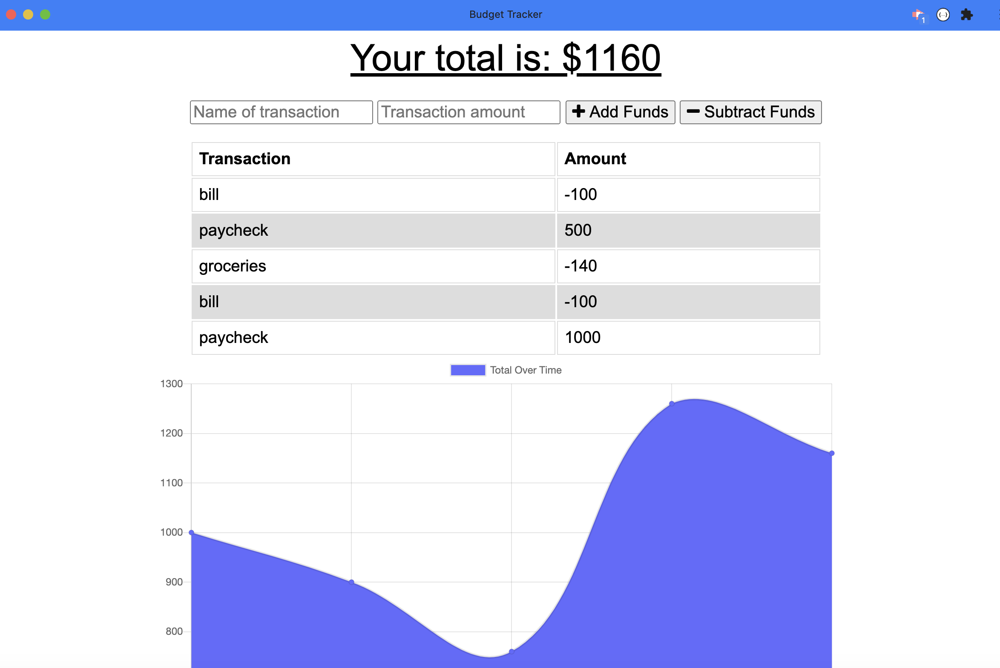
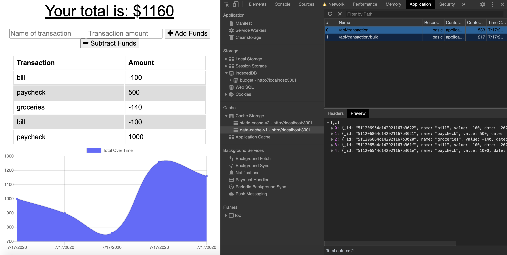
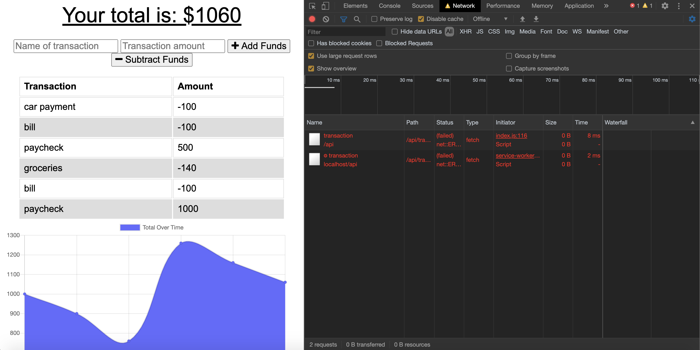
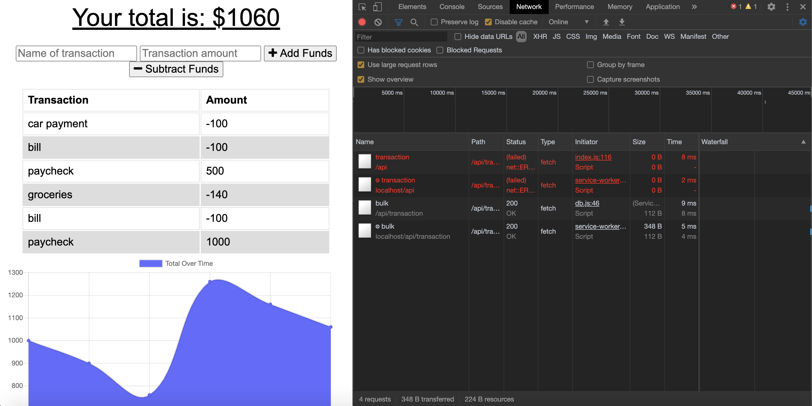

## **Progressive-Budget**
------

## **Live Link**

<h2><a href ="https://drive.google.com/file/d/1BUvFeUsamGjtDOg79cSfmvmoqLmdMBqO/view">Live Link</a></h2>

## **Description**
A progressive web app that keeps track of your budget. This app will allow a user to subtract expenses and add deposits to their budget. The user will be able to update the budget tracker either online or offline. The app will be functional with or without an internet connection. Any updates made to the budget tracker while offline will populate the total once the user is back online. 

## **Technology Stack**
* HTML 
* CSS
* Express.js
* JavaScript
* Node.js
* MongoDB
* Mongoose
* Heroku
* GitHub

## **Screenshots**

Progressive Web App: 

App updated and working offline: 

App updated and working online: 

## **Test**

  

## **Usage**

This application allows a user to keep track of their budget with or without an internet connection.

## **Contributors/Contact**

#### **Jessica Helft** 
* [@KingKitty89](https://github.com/KingKitty89)
* [Portfolio](https://kingkitty89.github.io/ResponsivePortfolio/)
* [jessicahelft@gmail.com](jessicahelft@gmail.com)
* [LinkedIn](https://www.linkedin.com/in/jessicahelft)
